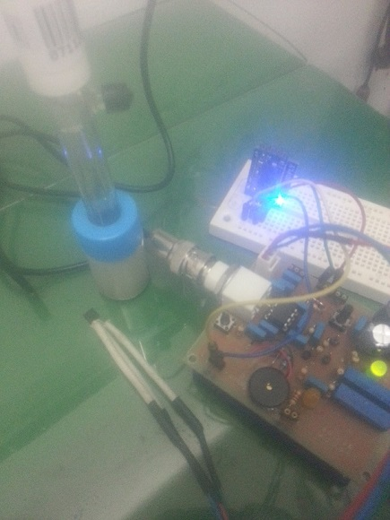
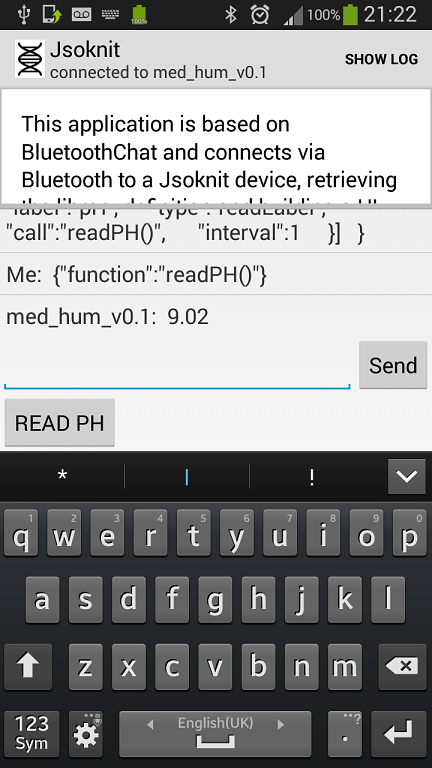

Jsoknit pH meter
==============

This is a serious mashup even I am more confused than usual. Anyway, here goes some documentation for future reference.  

[The bluetooth module hookup](https://github.com/dsikar/BT0417C-configuration)  

[The pH meter](https://github.com/hephesto/phduino) 

[The Android app](https://github.com/dsikar/android-jsoknit)

[The Arduino sketch](https://github.com/dsikar/arduino-jsoknit)

# Build instructions  

1. Build the pH meter shield
2. Pair shield with an Arduino (tested ok on UNO and Due)
3. Load Android app
4. Upload sketch
5. Pair device with phone
6. Send libdef string to list jsoknit device definition
7. Click READ PH button to get Ph.

The hardware side ends up looking a bit like this:  

  

While the Android app, after a **libdef** and a **readPH()** call looks like this:  

  

